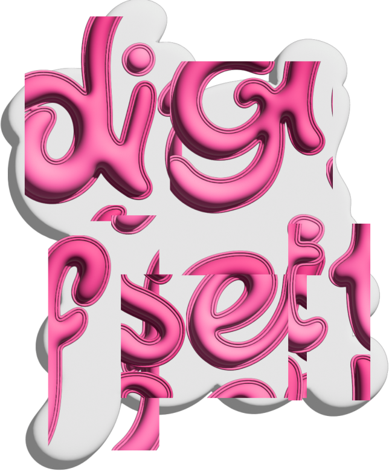

# DIGIFEST 2026 - Digital Innovation Grand Festival



**DIGIFEST 2026** adalah festival inovasi dan kompetisi teknologi tingkat nasional yang dirancang untuk mewadahi generasi muda dalam mengeksplorasi potensi digital dan menciptakan solusi inovatif.

## 🌟 Tentang DIGIFEST
Diselenggarakan oleh **Himpunan Mahasiswa Teknologi Informasi (HIMMATISI)** Universitas Semarang berkolaborasi dengan **Developer Community Universitas Semarang (DECOMUS)**.

- **Tema:** "SYNERGY (System, Youth, and Next-Generation Technology)"
- **Visi:** Menggabungkan kolaborasi sistem, kreativitas generasi muda, dan teknologi masa depan menjadi satu kesatuan visi yang berdampak.

## 🏆 Kategori Lomba & Kegiatan
1. **GENETIC (Innovation System Challenge)**
   - Kompetisi UI/UX Design dan Inovasi Sistem untuk siswa SMA/SMK sederajat.
2. **D’NAMIC (Dance Competition)**
   - Wadah kreativitas ekspresi budaya melalui inovasi seni tari.
3. **IT COMPETITION & AWARDING**
   - Pameran inovasi teknologi mahasiswa FTIK USM dan malam penganugerahan.

## 🚀 Teknologi yang Digunakan

### Frontend
- **Core:** [React 19](https://react.dev/), [TypeScript](https://www.typescriptlang.org/)
- **Build Tool:** [Vite](https://vitejs.dev/)
- **Styling:** [Tailwind CSS v4](https://tailwindcss.com/)
- **Animations:** 
  - [Framer Motion (Motion)](https://www.framer.com/motion/)
  - [GSAP (GreenSock Animation Platform)](https://gsap.com/)
- **Routing:** [React Router 7](https://reactrouter.com/)
- **Icons:** [React Icons](https://react-icons.github.io/react-icons/)

## 📂 Struktur Proyek
```text
DIGIFEST/
├── Frontend/           # Kode sumber aplikasi React (Vite)
│   ├── src/
│   │   ├── components/ # Komponen UI reusable (Navbar, Footer, dsb)
│   │   ├── ui/pages/   # Komponen halaman (Hero, Tentang, Timeline, dsb)
│   │   ├── lib/        # Library/utilitas kustom untuk animasi
│   │   └── assets/     # Asset statis (Gambar, Logo)
│   └── ...
└── Backend/            # (In Progress)
```

## 🛠️ Cara Menjalankan Proyek

### Prasyarat
- Node.js (versi terbaru direkomendasikan)
- npm atau yarn

### Langkah-langkah
1. **Clone repositori:**
   ```bash
   git clone https://github.com/username/digifest-2026.git
   cd digifest-2026
   ```

2. **Masuk ke direktori Frontend:**
   ```bash
   cd Frontend
   ```

3. **Instal dependensi:**
   ```bash
   npm install
   ```

4. **Jalankan mode pengembangan:**
   ```bash
   npm run dev
   ```

5. **Build untuk produksi:**
   ```bash
   npm run build
   ```

## 📅 Timeline Utama
- **Pendaftaran:** 1 Mei – 15 Juni 2026
- **Pengumpulan Karya:** s.d. 30 Juni 2026
- **Final & Awarding:** 8 Juli 2026

---
Managed by **HIMMATISI USM** & **DECOMUS**.
